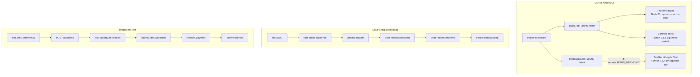
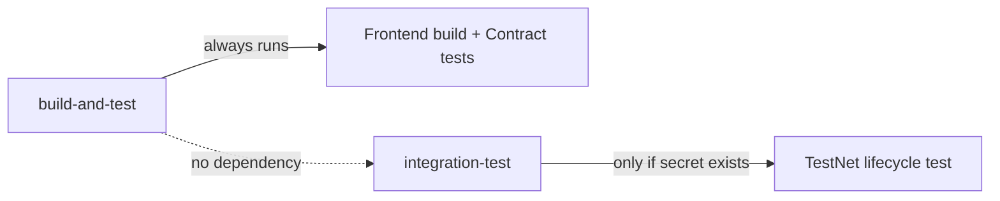

# Design Document: CI Setup & Integration

## Overview

This design covers three complementary deliverables that demonstrate engineering maturity for hackathon judges:

1. **GitHub Actions CI Pipeline** — Automated build/test on push and PR, with a visible status badge in the README.
2. **One-Command Local Setup** — A PowerShell script (`setup.ps1`) and cross-platform `Makefile` that boot the full stack in one command.
3. **End-to-End Integration Test** — A pytest module that exercises the full EscrowVault task lifecycle against real Algorand TestNet contracts using `py-algorand-sdk`.

The key design decision is separation of concerns: the CI pipeline runs the fast, deterministic contract unit tests by default, while the integration test is a separate conditional job that only triggers when the `ADMIN_MNEMONIC` secret is available (it requires TestNet access and funded accounts).

## Architecture



## Components and Interfaces

### 1. CI Workflow (`.github/workflows/ci.yml`)

| Component | Responsibility |
|-----------|---------------|
| `build-and-test` job | Runs frontend build + contract unit tests on every push/PR |
| `integration-test` job | Conditionally runs the TestNet lifecycle test when secrets are available |
| Workflow-level timeout | 10-minute cap to prevent runaway jobs |

**Interface with GitHub:**
- Trigger events: `push` to `main`, `pull_request` targeting `main`
- Secrets consumed: `ADMIN_MNEMONIC` (optional, gates integration job)
- Status: Reports pass/fail via commit status checks (powers the badge)

### 2. Status Badge (README.md)

A single Markdown image link at the top of `README.md`:
```markdown
[](https://github.com/{owner}/{repo}/actions/workflows/ci.yml)
```

The badge auto-reflects green/red based on the latest workflow run status.

### 3. Setup Script (`setup.ps1`)

| Step | Action | Error Handling |
|------|--------|----------------|
| 1 | `npm install` in `dojo-backend/` | Exit with error on failure |
| 2 | `npx prisma generate` + `npx prisma migrate dev` in `dojo-backend/` | Exit with DB error on failure |
| 3 | `npm install` in `dojo-frontend/` | Exit with error on failure |
| 4 | `Start-Process` backend (port 3001) | Background process |
| 5 | `Start-Process` frontend (port 3000) | Background process |
| 6 | Poll `http://localhost:3001` and `http://localhost:3000` (30s timeout each) | Exit with timeout error |
| 7 | Print success summary with URLs | — |

**Companion files:**
- `stop.ps1` — Terminates background processes by port
- `Makefile` — Linux/macOS equivalent with `make setup`, `make dev`, `make stop`

### 4. Integration Test (`tests/integration/test_task_lifecycle.py`)

| Phase | ABI Method | Validates |
|-------|-----------|-----------|
| Create task | `POST /api/tasks` (HTTP) | Backend creates DB record, returns task ID |
| Lock bounty | `lock_bounty` (algosdk) | On-chain box created, status=0 (LOCKED) |
| Submit task | `submit_task` (algosdk) | Status=1 (SUBMITTED), kite_hash stored |
| Release payment | `release_payment` (algosdk) | Status=2 (COMPLETED), funds distributed correctly |

**Key design decisions:**
- Uses `py-algorand-sdk` directly (NOT the `algopy_testing` harness) for real on-chain transactions
- Generates UUID-based task IDs to avoid collisions between test runs
- Derives worker/sensei/client accounts deterministically from the admin mnemonic (sub-accounts or uses admin as both admin and client for simplicity)
- 60-second overall timeout per lifecycle phase
- Loads config via `python-dotenv` for local runs, environment variables in CI

## Data Models

### EscrowVault Box Layout (137 bytes)

```
Offset  Size  Field           Type
0       32    client          Algorand Address (raw bytes)
32      32    worker          Algorand Address (raw bytes)
64      32    sensei          Algorand Address (raw bytes)
96      8     bounty_amount   uint64 (big-endian)
104     1     status          uint8 (0=LOCKED, 1=SUBMITTED, 2=COMPLETED, 3=SLASHED)
105     32    kite_hash       bytes32 (provenance hash)
```

### Integration Test Configuration

| Variable | Source | Default |
|----------|--------|---------|
| `ADMIN_MNEMONIC` | Env var / `.env` | None (test skips if missing) |
| `ALGOD_SERVER` | Env var / `.env` | `https://testnet-api.algonode.cloud` |
| `ESCROW_VAULT_APP_ID` | Env var / `.env` | `761941677` |
| `BACKEND_URL` | Env var / `.env` | `http://localhost:3001` |

### CI Workflow Configuration

```yaml
on:
  push:
    branches: [main]
  pull_request:
    branches: [main]

timeout-minutes: 10
```

## Error Handling

### CI Pipeline

| Failure Mode | Behavior |
|--------------|----------|
| `npm ci` fails (frontend) | Job fails immediately, skip subsequent steps |
| `npm run build` fails (frontend) | Job fails, red badge |
| `pip install` fails (contracts) | Job fails |
| `pytest` fails (contracts) | Job fails, red badge |
| Integration test timeout (60s) | Test marked failed, but doesn't block main job |
| Missing `ADMIN_MNEMONIC` | Integration job is skipped entirely |

### Setup Script

| Failure Mode | Behavior |
|--------------|----------|
| `npm install` fails | Print error with directory name, exit code 1 |
| `prisma migrate dev` fails | Print DB migration error, exit code 1 |
| Service doesn't respond within 30s | Print timeout error identifying the service, exit code 1 |
| Port already in use | Service fails to start, caught by health check timeout |

### Integration Test

| Failure Mode | Behavior |
|--------------|----------|
| `ADMIN_MNEMONIC` not set | `pytest.skip()` with clear message |
| Backend returns non-201 | `assert` failure with status code + response body |
| `lock_bounty` reverts | `assert` failure with transaction error message |
| `submit_task` reverts | `assert` failure with transaction error |
| `release_payment` fails | `assert` failure with task ID + reason |
| Network timeout (>60s) | `pytest.mark.timeout(60)` triggers failure |
| Balance check off | Tolerance-aware assertion (5000 µAlgo for fees) |

## Correctness Properties

*A property is a characteristic or behavior that should hold true across all valid executions of a system-essentially, a formal statement about what the system should do. Properties serve as the bridge between human-readable specifications and machine-verifiable correctness guarantees.*

PBT is not applicable to this feature. The deliverables consist of:

1. **CI workflow configuration** — Declarative YAML, not a function with inputs/outputs. Validated by GitHub Actions execution.
2. **Setup scripts** — Procedural orchestration with deterministic behavior. No meaningful input variation.
3. **Integration tests against Algorand TestNet** — External service interaction where each execution costs real network resources. Not cost-effective to run 100+ iterations, and behavior doesn't vary meaningfully with randomized inputs.

No universal "for all X, property P(X) holds" statements can be meaningfully formulated for these components. The existing contract unit tests in `dojo-contracts/tests/` already cover the smart contract logic with property-based patterns (see `test_escrow_properties.py`).

### Property 1: Not applicable

*For all* components in this feature (CI YAML, setup scripts, integration tests), no universal property can be meaningfully tested via property-based testing because these are infrastructure configuration, procedural scripts, and external-service integration rather than pure functions with varied inputs.

**Validates: Requirements 1.1, 2.1, 3.1, 4.1, 5.1, 6.1, 7.1, 8.1**

## Testing Strategy

### Testing Approach

This feature does NOT use property-based testing. The deliverables are:

1. **CI configuration** (YAML) — validated by GitHub Actions execution, not unit tests
2. **Setup scripts** (PowerShell/Makefile) — validated by manual execution on target platforms
3. **Integration tests** (pytest against real TestNet) — these ARE the tests themselves

**Why PBT doesn't apply:**
- CI workflows are declarative configuration files, not functions with varied inputs
- Setup scripts are procedural orchestration scripts with deterministic behavior
- The integration test interacts with external services (Algorand TestNet, backend API) where behavior doesn't vary meaningfully with randomized inputs and each execution costs real network resources

### Test Categories

| Category | What | How |
|----------|------|-----|
| **Unit tests** | Contract logic (existing in `dojo-contracts/tests/`) | `pytest` with `algopy_testing` harness — runs in CI `build-and-test` job |
| **Integration test** | Full lifecycle against TestNet | `pytest` in `tests/integration/` — runs in CI `integration-test` job (conditional) |
| **Manual validation** | Setup script boots the stack | Run `setup.ps1` on Windows, `make setup` on Linux/Mac |

### Integration Test Structure

```python
# tests/integration/test_task_lifecycle.py
class TestTaskLifecycle:
    def test_create_task_and_lock_bounty(self):
        """Req 4: POST task → lock_bounty → verify box status=LOCKED"""
        
    def test_submit_task_with_provenance(self):
        """Req 5: submit_task → verify status=SUBMITTED, kite_hash stored"""
        
    def test_release_payment_and_verify_distribution(self):
        """Req 6: release_payment → verify status=COMPLETED, balances correct"""
```

Each test method is ordered and depends on the previous (uses `pytest-ordering` or a single sequential test function to ensure lifecycle order).

### Test Dependencies

```
tests/integration/requirements.txt:
  py-algorand-sdk>=2.6.0
  pytest>=7.4.0
  pytest-timeout>=2.2.0
  python-dotenv>=1.0.0
  requests>=2.31.0
```

### CI Job Separation



The integration job runs independently (not blocked by the build job) but shares the same trigger events. This means a PR can pass the main checks even when the integration test is unavailable (e.g., in forks without secrets).
