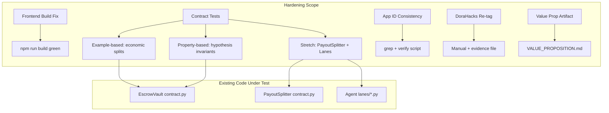

# Design Document: Semifinal Hardening

## Overview

This design covers the technical approach for hardening the 0rca Swarm Dojo project ahead of the Algorand hackathon semifinal. The effort spans seven requirements across four scoped areas: frontend build health, contract test coverage (example-based and property-based), Algorand discoverability/consistency, and a value proposition artifact.

No deployed contract logic changes. All work produces verifiable evidence (green builds, passing tests, consistent docs, a judge-facing artifact) that can be inspected by hackathon reviewers.

### Design Principles

1. **No runtime changes** — tests validate existing deployed contract code as-is.
2. **pytest + algopy_testing** — contract tests use the existing test harness pattern already established in `dojo-contracts/tests/`.
3. **hypothesis** — property-based tests use the Hypothesis library to generate bounty amounts across the uint64 range.
4. **Evidence-first** — each requirement produces a committed artifact or log proving completion.
5. **Iterative fix loops** — frontend build fix is a correct-and-rerun cycle; App ID check is a grep-and-compare cycle.
6. **Manual steps documented** — DoraHacks re-tag is a human action; design specifies evidence recording.

## Architecture



## Components and Interfaces

### Component 1: Frontend Build Fix (Requirement 1)

**Scope:** `dojo-frontend/`

**Approach:**
1. Run `npm run build` in `dojo-frontend/`.
2. Identify TypeScript compilation errors from stdout/stderr.
3. Fix each error — expected issues include wallet signer types, `sha256` imports, `from` type references, and Socket.IO client type resolution.
4. Re-run until exit code 0 with zero TS errors.
5. Record evidence: create `dojo-frontend/BUILD_EVIDENCE.md` with the build command, working directory, exit code, and Node.js/npm versions.

**Interface:** None — this is a build fix producing a committed evidence file.

**Key fixes expected:**
- `socket.io-client` types: ensure `@types/socket.io-client` or bundled types resolve (socket.io-client v4+ bundles its own types).
- Wallet signer types: add explicit type annotations or casts for algosdk signer references.
- `sha256`/`from` references: correct import paths or add missing type declarations.

### Component 2: Economic Example Tests (Requirement 2)

**Scope:** `dojo-contracts/tests/test_escrow_vault.py` (extend existing file or add `test_escrow_economic.py`)

**Approach:** Add a new test class `TestEconomicSplits` following the existing test patterns (fixtures `context`, `deployed`, `accounts`, helper `_lock_bounty`).

**New test functions:**

| Test | What it verifies |
|------|-----------------|
| `test_release_fee_and_sensei_amounts` | Treasury gets `(bounty * 200) // 10000`, sensei gets `bounty - fee`. Uses amount 1_000_033 (not divisible by 50) to exercise truncation. |
| `test_release_conservation_of_funds` | `fee + sensei_payment == bounty` for a concrete amount. |
| `test_release_requires_submitted_status_locked` | Release fails on LOCKED (status=0). |
| `test_release_requires_submitted_status_completed` | Release fails on COMPLETED (status=2). |
| `test_release_requires_submitted_status_slashed` | Release fails on SLASHED (status=3). |
| `test_release_requires_nonzero_kite_hash` | Release fails when kite_hash is 32 zero bytes. |
| `test_slash_returns_full_bounty` | Client gets 100% of bounty, no fee deducted. |
| `test_slash_fails_on_completed` | Slash fails on status=2. |
| `test_slash_fails_on_slashed` | Slash fails on status=3. |
| `test_release_unauthorized` | Random account cannot release. |
| `test_slash_unauthorized` | Random account cannot slash. |

**Observing inner payments:** The `algopy_testing` context captures inner transactions. Tests will inspect `context.txn.last_group` or the inner transaction log to verify payment amounts and receivers.

### Component 3: Property-Based Economic Tests (Requirement 3)

**Scope:** New file `dojo-contracts/tests/test_escrow_properties.py`

**Library:** `hypothesis` (Python property-based testing library)

**Configuration:**
- `@settings(max_examples=200)` — exceeds the 100-minimum requirement.
- `@example` decorators for boundary values: 1, 49, 50, 51, 2**64 - 1.
- Each test tagged with a comment: `# Feature: semifinal-hardening, Property N: <text>`

**Test structure:** Each property test generates a bounty amount via `st.integers(min_value=1, max_value=2**64 - 1)`, sets up the contract context (lock → submit → release/slash), and asserts the property.

### Component 4: Stretch Tests (Requirement 4)

**PayoutSplitter tests:** New file `dojo-contracts/tests/test_payout_splitter_economic.py`
- Test `split_percentage` conservation: generate 1–16 recipients with percentages summing to 10000 bps, verify sum of payments == input.
- Test `split_percentage` rejection: percentages not summing to 10000 → assertion error.

**Agent lane tests:** New file `dojo-agents/tests/test_lane_validation.py`
- Test each lane's `validate_task_payload` with valid and invalid payloads.
- Research: requires `query` or `description`.
- Code: requires `description` or `query`.
- Data: requires `data` or `operation`.
- Outreach: requires `recipient` or `goal`.

### Component 5: App ID Consistency Verification (Requirement 5)

**Scope:** Repository-wide grep

**Approach:**
1. `grep -rn` for each of the four App IDs (758815322, 761941677, 761941684, 758815334) across all `.md`, `.env`, `.env.example`, and config files.
2. For each match, verify the surrounding context maps the ID to the correct contract name.
3. If mismatched or orphan IDs found, correct them.
4. Record evidence: create `evidence/APP_ID_VERIFICATION.md` listing each file checked and outcome.

**Authoritative App ID set:**
- DojoRegistry: 758815322
- EscrowVault: 761941677
- CommitmentLock: 761941684
- PayoutSplitter: 758815334

### Component 6: DoraHacks Re-tag (Requirement 6)

**Scope:** External platform action (manual)

**Approach:**
1. Maintainer navigates to the DoraHacks submission page.
2. Adds "Algorand" tag while retaining existing "AI / Robotics" tag.
3. Verifies both tags visible on public page.
4. Records evidence: create `evidence/DORAHACKS_TAGS.md` with the final tag set, public URL, and screenshot filename or timestamp.

**Fallback:** If the tag cannot be added (platform limitation), record the reason in the same evidence file.

### Component 7: Value Proposition Artifact (Requirement 7)

**Scope:** New file `VALUE_PROPOSITION.md` at repository root

**Content structure:**
1. **Cost Advantage** — 98% developer take (2% protocol fee) vs ~20% centralized freelance fees, ≥30% other platform cuts.
2. **Settlement Speed** — 3.3s Algorand finality vs 1+ day (multi-day) centralized payouts.
3. **Blockchain Rationale** — four elements: trustless collateral-backed escrow, ungameable on-chain reputation, atomic payment+app-call transaction groups, instant settlement.
4. **Unit Economics** — derived from GTM_PLAN.md: 2% fee, 10% slash, average 5 ALGO bounty → 0.1 ALGO protocol revenue per task.

**Constraint:** All figures must match `GTM_PLAN.md` exactly. Cross-reference check before commit.

## Data Models

### EscrowVault Box Layout (existing, not modified)

| Offset | Length | Field | Type |
|--------|--------|-------|------|
| 0 | 32 | client address | bytes |
| 32 | 32 | worker address | bytes |
| 64 | 32 | sensei address | bytes |
| 96 | 8 | bounty amount | uint64 big-endian |
| 104 | 1 | status | uint8: 0=LOCKED, 1=SUBMITTED, 2=COMPLETED, 3=SLASHED |
| 105 | 32 | kite_hash | bytes (32 zeros = unset) |

**Total:** 137 bytes per task box.

### Economic Formulas (existing, tested not modified)

```python
fee = (bounty * 200) // 10000       # 2% floored
sensei_payment = bounty - fee        # 98% + remainder
# fee == 0 when bounty < 50 (since 49*200//10000 = 0)
# fee first becomes 1 when bounty == 50 (50*200//10000 = 1)
```

### PayoutSplitter Percentage Split (existing, tested not modified)

```python
# For N recipients with percentages summing to 10000 bps:
for i in range(N):
    if i == N - 1:
        amount = total - distributed  # last gets remainder
    else:
        amount = (total * percentages[i]) // 10000
        distributed += amount
```

### Agent Lane Validation Requirements (existing, tested not modified)

| Lane | Required Fields (any one of) |
|------|------------------------------|
| Research | `query` OR `description` |
| Code | `description` OR `query` |
| Data | `data` OR `operation` |
| Outreach | `recipient` OR `goal` |

## Correctness Properties

*A property is a characteristic or behavior that should hold true across all valid executions of a system — essentially, a formal statement about what the system should do. Properties serve as the bridge between human-readable specifications and machine-verifiable correctness guarantees.*

### Property 1: Fee formula correctness

*For any* bounty amount in the uint64 range [1, 2^64 - 1], when release_payment settles a SUBMITTED task with a valid kite_hash, the treasury fee SHALL equal `(bounty * 200) // 10000` and the sensei payment SHALL equal `bounty - fee`.

**Validates: Requirements 2.1, 3.2**

### Property 2: Conservation of funds on release

*For any* bounty amount in the uint64 range, when release_payment settles a task, the sum of the treasury fee and the sensei payment SHALL equal the original bounty amount (`fee + sensei_payment == bounty`).

**Validates: Requirements 2.2, 3.1**

### Property 3: Release guard — no payout without valid preconditions

*For any* task state where the status is not SUBMITTED (i.e., LOCKED, COMPLETED, or SLASHED) OR the kite_hash is zero, when release_payment is invoked, the call SHALL fail with an assertion error, no inner payment SHALL be issued, and the task status SHALL remain unchanged.

**Validates: Requirements 2.3, 2.4, 3.4**

### Property 4: Slash returns full bounty

*For any* bounty amount in the uint64 range, when slash_bounty settles a task whose status is LOCKED or SUBMITTED (status ≤ 1), the client refund SHALL equal the full bounty amount with no fee deducted (`refund == bounty`).

**Validates: Requirements 2.5, 3.3**

### Property 5: Slash guard — no refund on already-settled tasks

*For any* task whose status is COMPLETED (2) or SLASHED (3), when slash_bounty is invoked, the call SHALL fail with an assertion error, no inner payment SHALL be issued, and the task status SHALL remain unchanged.

**Validates: Requirements 2.6**

### Property 6: Authorization guard

*For any* account that is neither the client nor the admin, when that account invokes release_payment or slash_bounty, the call SHALL fail with an authorization assertion error, no inner payment SHALL be issued, and the task status SHALL remain unchanged.

**Validates: Requirements 2.7**

### Property 7: PayoutSplitter conservation of funds

*For any* payment amount and any set of 1–16 recipients whose percentages sum to exactly 10000 basis points, when split_percentage distributes the payment, the sum of all recipient payments SHALL equal the original payment amount.

**Validates: Requirements 4.1**

### Property 8: PayoutSplitter rejects invalid percentage sums

*For any* set of percentages that do NOT sum to exactly 10000 basis points, when split_percentage is called, the call SHALL fail with an assertion error and no recipient payment SHALL be dispatched.

**Validates: Requirements 4.2**

### Property 9: Agent lane payload validation

*For any* agent lane and any payload, `validate_task_payload` SHALL return True if and only if the payload contains at least one of the lane's required fields (Research: `query`/`description`; Code: `description`/`query`; Data: `data`/`operation`; Outreach: `recipient`/`goal`).

**Validates: Requirements 4.3, 4.4**

## Error Handling

### Contract Tests — Negative Paths

- All negative-path tests (unauthorized caller, wrong status, zero kite_hash) assert that an `AssertionError` is raised.
- The `algopy_testing` harness propagates assertion failures from the contract as Python `AssertionError` exceptions.
- Tests use `pytest.raises(AssertionError, match="<expected message>")` to verify both the failure and the specific guard that triggered.
- After a failed call, tests verify the task box status byte is unchanged (no side effects).

### Frontend Build — Error Recovery

- TypeScript errors are addressed iteratively. Each error message identifies the file, line, and type issue.
- Common error categories and fixes:
  - **Missing type imports:** Add explicit imports or install `@types/*` packages.
  - **Implicit any:** Add type annotations.
  - **Module not found:** Verify dependency in `package.json`, run `npm install`.
- The cycle terminates only on exit code 0 with zero errors.

### App ID Verification — Mismatch Handling

- Mismatches are corrected in place and the scan re-run.
- Orphan IDs (not in the authoritative set) are removed or updated.
- All corrections are committed with the evidence file.

### Property Tests — Boundary Handling

- The uint64 maximum (2^64 - 1 = 18,446,744,073,709,551,615) is included via `@example`.
- Bounty of 0 is excluded (not a valid bounty — lock_bounty requires a payment > 0).
- Bounties 1–49 produce fee=0, which is valid (sensei gets 100% of these micro-bounties).

## Testing Strategy

### Property-Based Testing (Hypothesis)

**Library:** `hypothesis` (Python)
**Why PBT applies:** The EscrowVault and PayoutSplitter implement pure arithmetic formulas (fee splits, conservation invariants) over a large input space (uint64 bounty amounts, 1–16 recipient splits). Universal properties hold for all inputs, and 100+ iterations surface edge cases around floor-division boundaries.

**Configuration:**
- Minimum 100 examples per property (`@settings(max_examples=200)`)
- Boundary values via `@example(1)`, `@example(49)`, `@example(50)`, `@example(51)`, `@example(2**64 - 1)`
- Tag format: `# Feature: semifinal-hardening, Property N: <property_text>`
- Each correctness property maps to exactly one `@given`-decorated test function

**File:** `dojo-contracts/tests/test_escrow_properties.py`

### Example-Based Unit Tests (pytest)

- Specific concrete scenarios with hand-picked amounts (1_000_000, 1_000_033, 5_000_000).
- Negative path tests for each guard condition.
- Authorization tests with specific unauthorized accounts.

**File:** `dojo-contracts/tests/test_escrow_economic.py` (or extend `test_escrow_vault.py`)

### Stretch Tests

- PayoutSplitter property tests: `dojo-contracts/tests/test_payout_splitter_properties.py`
- Agent lane validation tests: `dojo-agents/tests/test_lane_validation.py`

### Non-Automated Verification

| Requirement | Verification Method |
|-------------|-------------------|
| Req 1 (Frontend build) | `npm run build` exit code 0 + evidence file |
| Req 5 (App ID consistency) | grep scan + evidence file |
| Req 6 (DoraHacks re-tag) | Manual action + evidence file |
| Req 7 (Value prop artifact) | Manual review + cross-reference against GTM_PLAN.md |

### Test Execution

```bash
# Contract tests (example + property)
cd dojo-contracts && pytest tests/ -v

# Agent lane tests
cd dojo-agents && pytest tests/test_lane_validation.py -v
```

All tests must pass with exit code 0 before the hardening effort is considered complete.
